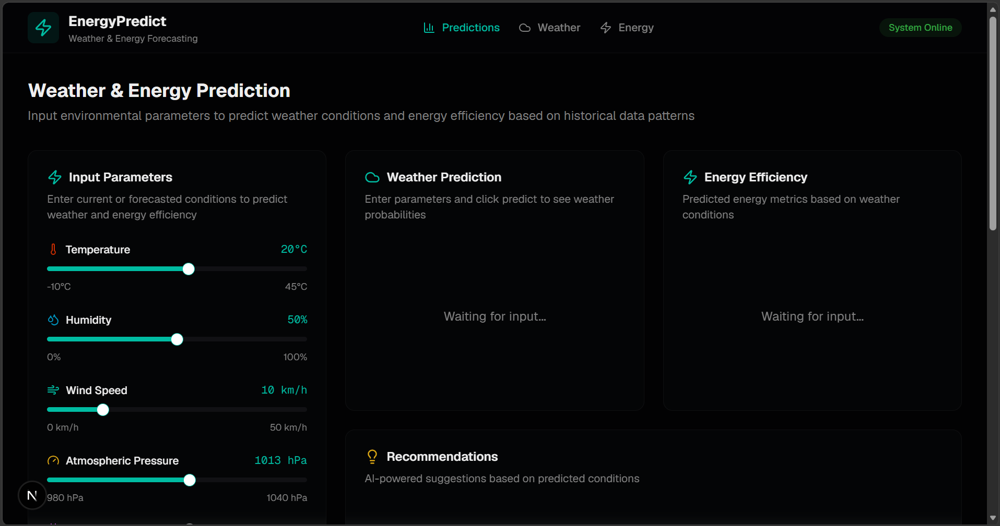
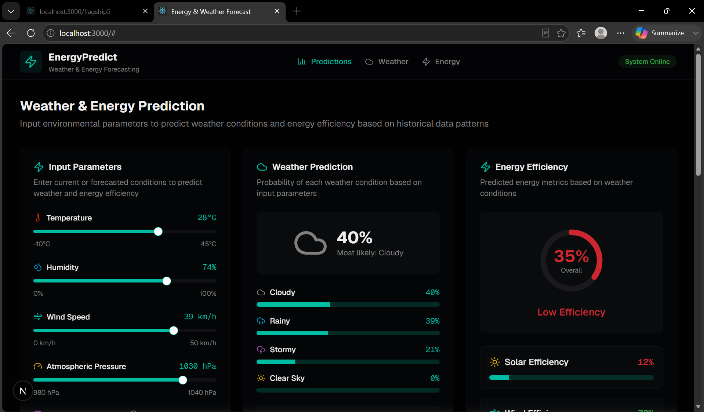
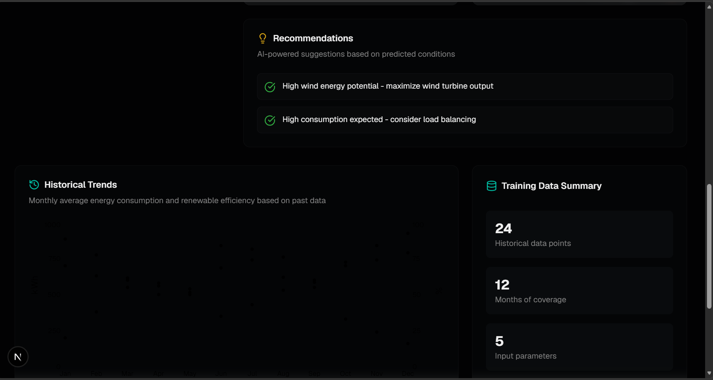
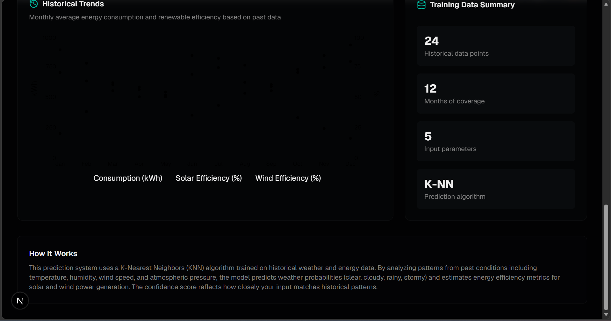

# ⚡ AI Energy & Weather Forecast


An AI-powered dashboard that predicts weather conditions and renewable energy efficiency based on environmental parameters. Built using **Next.js**, **TypeScript**, and modern UI components to provide an interactive forecasting experience.

---

# 📸 Screenshots

## 🏠 Homepage



---

## 🌦 Prediction Dashboard



---

## 📊 Historical Analytics



---

## 🤖 Prediction Algorithm




---

# ✨ Features

- 🌦 Weather condition prediction
- ⚡ Renewable energy efficiency estimation
- 🤖 K-Nearest Neighbors (KNN) prediction engine
- 🌡 Environmental parameter controls
- 📊 Historical trend visualization
- ☀ Solar efficiency analysis
- 🌬 Wind efficiency estimation
- ⚡ Energy consumption prediction
- 📈 Interactive charts using Recharts
- 💡 Smart AI recommendations
- 📱 Responsive dashboard
- 🌙 Modern dark interface

---

# 🛠 Tech Stack

### Frontend

- Next.js 16
- React 19
- TypeScript
- Tailwind CSS
- shadcn/ui

### Visualization

- Recharts
- Lucide React

### Prediction

- K-Nearest Neighbors (KNN)
- Historical Weather Dataset

### Development

- npm
- ESLint
---

# 📂 Project Structure

```
app/
components/
hooks/
lib/
styles/
public/

package.json
next.config.mjs
tsconfig.json
```

---

# 🚀 Installation

```bash
git clone https://github.com/tanushkhare/ai-energy-weather-forecast.git

cd ai-energy-weather-forecast

npm install

npm run dev
```

Open

```
http://localhost:3000
```

---

# 💻 Usage

Adjust the following environmental parameters:

- Temperature
- Humidity
- Wind Speed
- Atmospheric Pressure
- Month
- Time of Day

Click **Generate Prediction** to receive:

- Weather probabilities
- Energy efficiency score
- Solar efficiency
- Wind efficiency
- Estimated energy consumption
- AI-based recommendations

---

# 📊 Prediction Parameters

Current inputs include:

- Temperature
- Humidity
- Wind Speed
- Pressure
- Month
- Time of Day

Predicted outputs:

- Clear Sky Probability
- Cloud Probability
- Rain Probability
- Storm Probability
- Overall Energy Efficiency
- Solar Efficiency
- Wind Efficiency
- Energy Consumption
- Prediction Confidence

---

# 🚀 Future Improvements

- 🌍 OpenWeatherMap API integration
- 🤖 Deep Learning forecasting model
- 📈 Time-series forecasting using LSTM
- ☀ UV Index prediction
- 🌫 Air Quality Index (AQI)
- 🌧 Rainfall prediction
- 🔋 Battery storage estimation
- ⚡ Solar panel output prediction
- 🌍 CO₂ emissions analysis
- 📄 Export reports as PDF
- ☁ One-click deployment
---

# 🌐 Live Demo

Coming Soon (Vercel)

---

# 👨‍💻 Author

**Tanush Vishal Khare**

GitHub:
https://github.com/tanushkhare

LinkedIn:
https://www.linkedin.com/in/tanush-khare-849167319

---